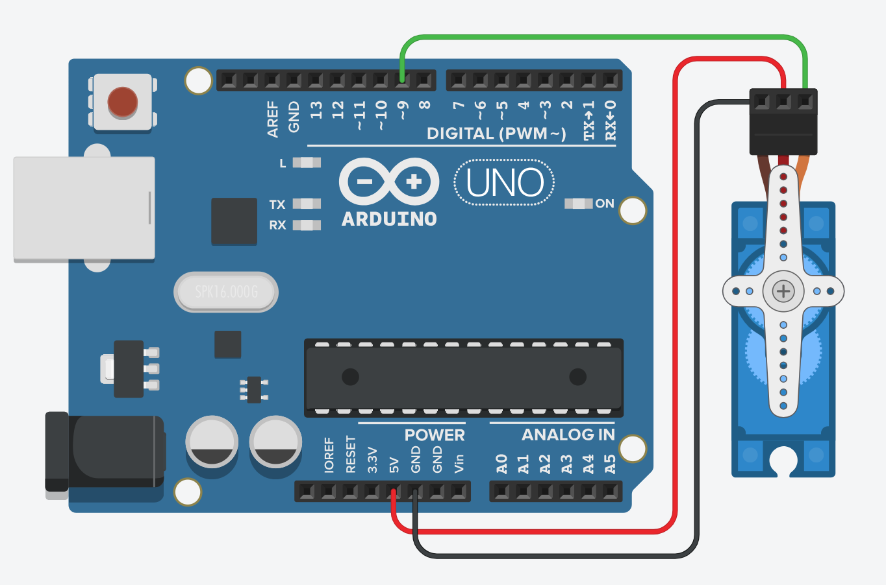

# Onmyoji-X-Arduino
A hardware helper using **Arduino UNO R3** combined with GUI for the award winning game **[Onmyoji](https://en.onmyojigame.com/)** on smartphones. This helper supports auto challenge for Orochi/Evo Materials/Sougenbi/Totem modes with a list of customized choices and is recommended for solo challenge.

This Java program controls the micro servo attached to Arduino board via **jSerialComm** library, recognizes the game status as win/lose at the end of each round and automatically taps screen to continue playing the next round when you win the previous one. If the application fails to find a match for win or lose after a certain period, it'll keep listening for another 30 secs and finally terminates if no match found. 

You may choose to get an alert upon task failure/task complete before starting the task in order to get notification without keeping an eye on the game progress. You may also configure all parameters (duration of each round, number of rounds to play, etc) in the application for the best result. 

[[Learn more about the GUI version]](#GUI)

## Why to use?
There're lots of auto clicker apps of choice that could do exactly the same job, but you may risk being punished or even banned while you use them as they can be detected. However, this hardware helper behaves naturally like human touching the screen and won't be detected anyway. 

Even though Onmyoji has included the auto challenge feature in a recent release, it requires a large consumption of the precious sakuramochi and doesn't support the Totem or Sougenbi mode. 

## Library Dependencies
- OpenCV 3.4.1
- jSerialComm

## Software
Quicktime Player

## Hardware
 - Arduino UNO R3
 - A micro servo (SG 90)
 - A stylus pen

<a name="GUI"></a>

## GUI for Onmyoji-X-Arduino
The graphical user interface is designed and developed using JavaFX and Scene Builder.

### Interface Preview (on Mac):
1. Configurations before starting the job:


2. While running the job:


### Usage:
1. Download everything under the [GUI/build](GUI) directory, make sure they stay in the same directory.

2. Cast screen of your mobile device to your computer and place the window to the top-left corner.

3. Take distinct screenshots for game win/lose, rename them as ```Win.jpg/Lose.jpg``` and place them under the imgs folder to define different game status. (Please refer to example images under the [sampleScreenshots](sampleScreenshots) directory).

4. Connect Arduino board to your computer, copy the [Arduino code](arduino/servoCtrl.ino) and upload it to the board via [Arduino IDE](https://www.arduino.cc/en/Main/Software).

5. Connect the micro servo to Arduino board following the instruction diagram below:



6. Attach the stylus pen to the servo and adjust it to appropriate position so that it could tap the 'challenge' button easily on your phone.

7. Lock your most reliable 'lineup' for the auto challenge in game.

8. Open ```Onmyoji_x_Arduino.jar```, select Arduino port and connect to it. (the port is auto selected for mac)

9. Configure all the parameters refering to the interface preview above for your best result.

10. Start job and enjoy!


## OpenCV Installation Guide (for development/debugging only)
 1. Install dependencies (Apache Ant, CMake required)
 2. Download opencv extended modules from official Git repo
 3. Access the OpenCV-3.4.1 directory in terminal, type commands:
 
 ```
    mkdir build
    cd build
 ```
 4. Open CMake GUI
     - Set full path to OpenCV source code, e.g. /home/user/opencv
     - Set full path to <cmake_build_dir>, e.g. /home/user/opencv/build
     - Click 'configure' 
     - Find name 'OPENCV_EXTRA_MODULES_PATH'
     - Set value to your extra modules directory (e.g. '/Users/../opencv-3.4.1/extra_modules/modules')
     - Click 'configure' 
     - Click 'generate' 
     - Done
 5. Stay under the OpenCV-3.4.1/build directory in terminal, type commands:
 
     ```
        make -j8 # runs 8 jobs in parallel
        sudo make install
     ```
     
     The installation process could take about 10 ~ 30 mins.

